# 昆虫知识常用网站

汇集了一些常用的查阅昆虫资料的网站，主要偏向于分类和生态学方向（因本人方向是蚂蚁生态的，分子方向接触的不多）。所有网站均根据本人自己使用以及各位师兄师姐师弟师妹的使用体验后觉得不错收录进来的。

**为什么要做这个仓库？**

主要目的是很多的昆虫研究者和学生在初接触这一行时，会遇到很多知识需要Google/百度一下，甚至某百科的结果准确性不够，为此浪费了大量的时间和精力（~~比如我~~）。所以这样一个汇总的仓库可以帮助你更快地找到一些资料，让你节约一些时间。

本目录暂时收录较少，会逐渐慢慢补充，也欢迎大家把你非常推荐的网站介绍出来，让所有人都能学习。

PS：个人精力有限，不定期更新，欢迎更多人来维护。如有建议或吐槽，欢迎联系我的邮箱yandicnly@gmail.com。

## 目录

* [综合类/Integrated](#综合类integrated)
   * [嘎嘎昆虫网](#嘎嘎昆虫网)
   * [昆虫网](#昆虫网)
   * [中国动物主题数据库](#中国动物主题数据库)
   * [Catalogue of life/生命目录](#catalogue-of-life生命目录)
   * [GBIF/全球生物多样性信息设施](#gbif全球生物多样性信息设施)
   * [全球入侵物种数据库](#全球入侵物种数据库)
   * [入侵物种概要](#入侵物种概要)
* [蚂蚁/Ants](#蚂蚁ants)
   * [AntWiKi](#antwiki)
   * [AntWeb](#antweb)
   * [AntCat](#antcat)
   * [AntMaps](#antmaps)
   * [蚁网](#蚁网)
   * [蚂蚁分类图摘AntsPic](#蚂蚁分类图摘antspic)
* [介壳虫/Scale](#介壳虫scale)
   * [ScaleNet](#scalenet)
* [直翅目/Orthoptera](#直翅目orthoptera)
   * [Orthoptera Species File Online/直翅目物种文件在线](#orthoptera-species-file-online直翅目物种文件在线)
* [学术相关/Scholar](#学术相关scholar)
   * [期刊简写查询](#期刊简写查询)
   * [术语在线](#术语在线)

## 综合类/Integrated

### 嘎嘎昆虫网

[👉网页URL](http://gaga.biodiv.tw/9701bx/in5.htm)

这是一个台湾的昆虫图鉴网站，汇集了很多台湾的常见昆虫生态图片，配有一定的简短介绍，还对雌雄做了区分以及加上了在**台湾地区**的稀有程度。里面还有一些蜘蛛的图鉴，个人觉得算是非常不错的网站了，非常值得推荐。

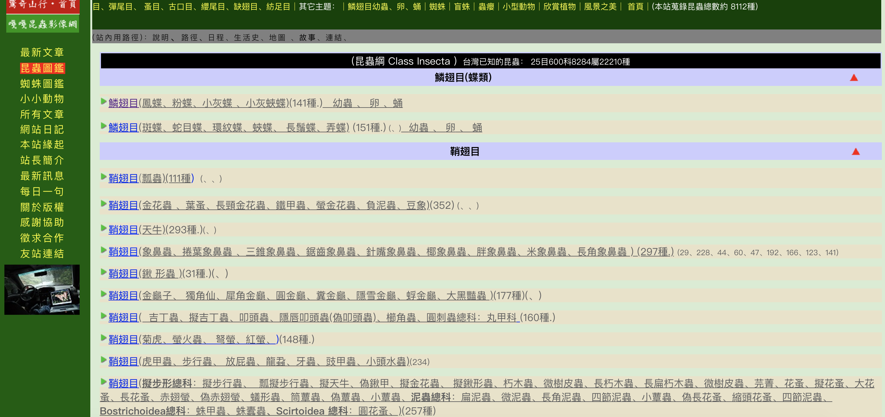

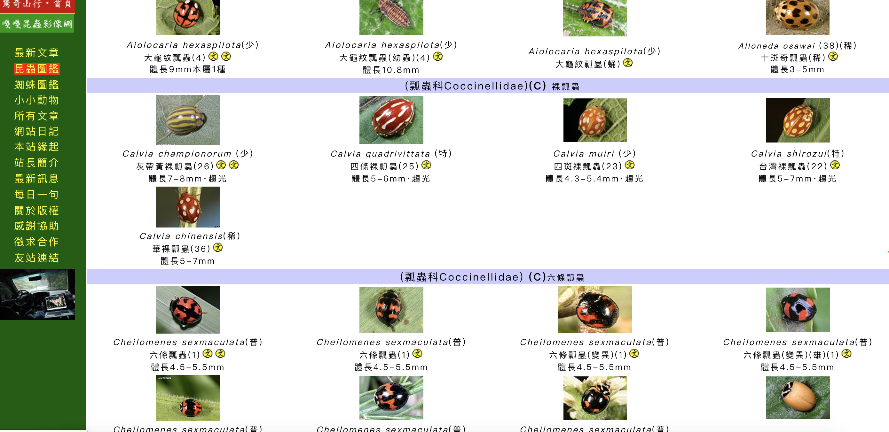

### 昆虫网

[👉网页URL](http://www.insects.site/index.html)

> **重要提示**：由于文字撰写和图片授权付出了编辑的很大努力,所以,未经许可,本站原创和独家接受授权的那部分文字和图片是不能转载或引用的哦。谢谢合作~

这是该网站的声明信息，网址是我在知乎的[这个回答](https://www.zhihu.com/question/335047213/answer/751746737)（@非正常猴类）中找到的，看了一下似乎很多目还没完全做好，蚂蚁数据是比较全的，其实就是下面会提到的[蚁网](#蚁网)，大家看看就好。

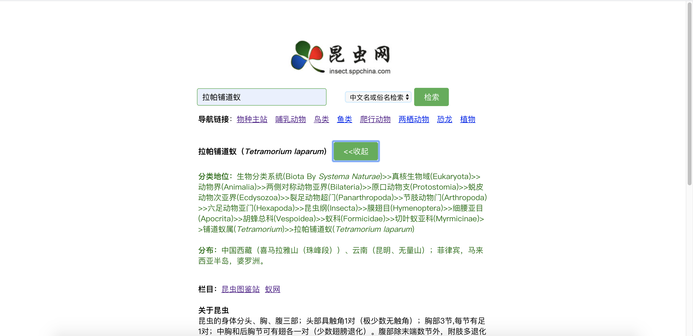

### 中国动物主题数据库

[👉网页URL](http://www.zoology.csdb.cn/page/index.vpage)

> 中国动物主题库包括：脊椎动物代码数据库、动物物种编目数据库、动物名称数据库、《中国动物志》出版与编研信息数据库、濒危和保护动物数据库、中国昆虫新种数据库、中国昆虫模式标本数据库、动物研究专家数据库、中国动物志数据库、中国动物图谱数据库、中国蜜蜂数据库、中国隐翅虫名录数据库、云南鸟类数据库、中国灵长类物种及文献数据库、中国两栖爬行动物数据库、中国直翅目昆虫数据库、中国鸟类数据库、中国内陆水体鱼类数据库、西南县级脊椎动物分布名录、西南保护区脊椎动物分布名录、云南蝴蝶分布名录、云南森林昆虫分布名录。

中科院的项目，所有数据均由动物学专家审核确认后收录到数据库中，数据质量得到了保障，是目前国内动物学领域规模最大、权威性最强的数据库服务系统。但个人感觉不是太好用😅。

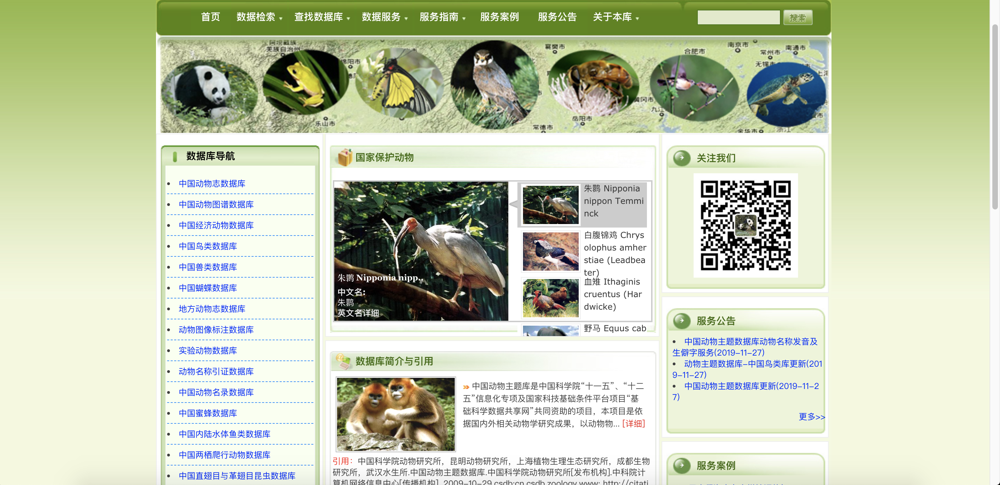

### Catalogue of life/生命目录

[👉网页URL](http://www.catalogueoflife.org/)

《Catalogue of life》是由全球3000多个分类学专家提供和审核的分类检索网站，包含180多万种动植物、微生物的索引，可以查询到所属的分类阶元、地理分布等信息，这是老师推荐给我们的，主要用来检索当前有效名称及是否存在重名。

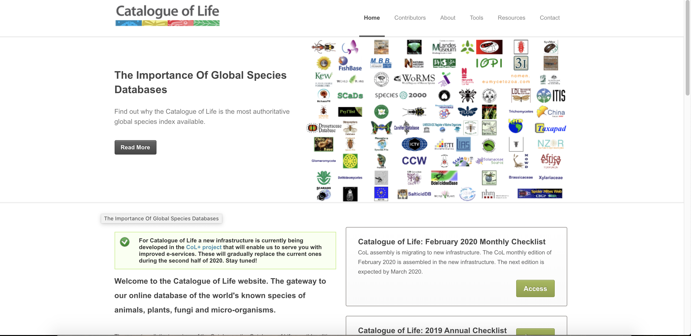

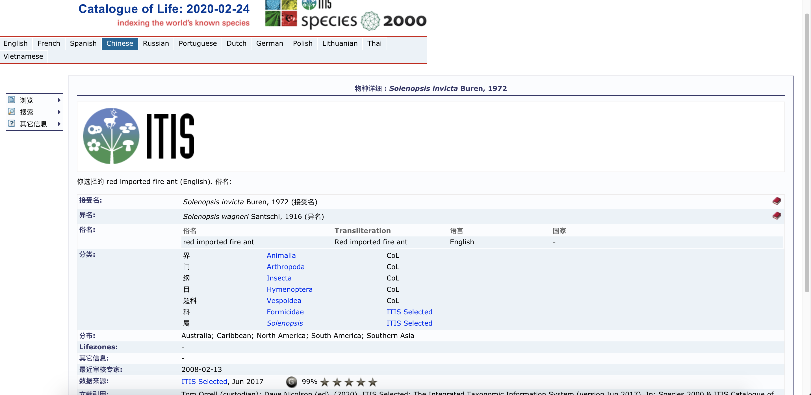

### GBIF/全球生物多样性信息设施

[👉网页URL](https://www.gbif.org/)

> GBIF（全球生物多样性信息设施）是由世界各国政府资助的国际网络和研究基础设施，旨在为任何地方，任何人提供对地球上各种生命数据的开放访问。

记录了全球大部分物种分布的国家或地区，会给出详细的经纬度和记录依据。本质上是一个开放的数据库，并且资料都可以下载。

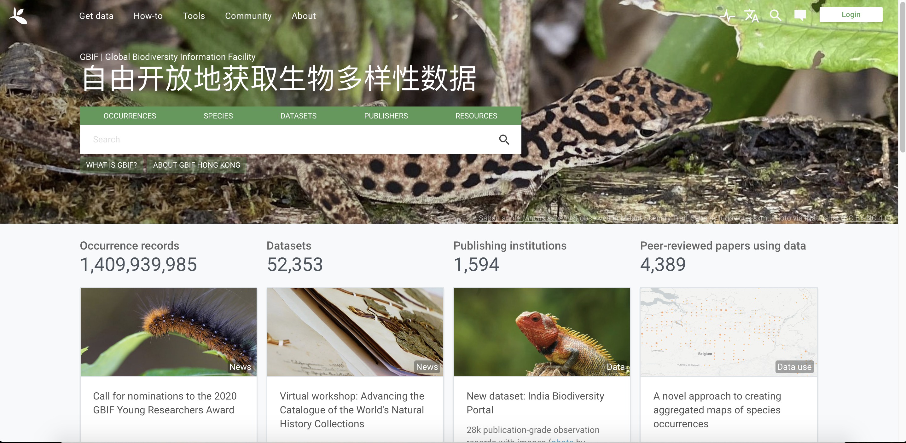

### 全球入侵物种数据库

[👉网页URL](http://www.iucngisd.org/gisd/)

相信大家在做昆虫或者植物的研究时，经常会遇到入侵/检疫等关键字，这个网址的作用就是检索入侵种的信息，值得注意的是该网站最好使用拉丁名去检索，通用的英文名效果不是太好，结果会显示查询的入侵种的基本信息，分布点及影响等相关信息。该网站的右上角有个**100 of the worst**，点进入会显示当前全球前100种入侵物种的信息，截止目前是2013年的更新数据。

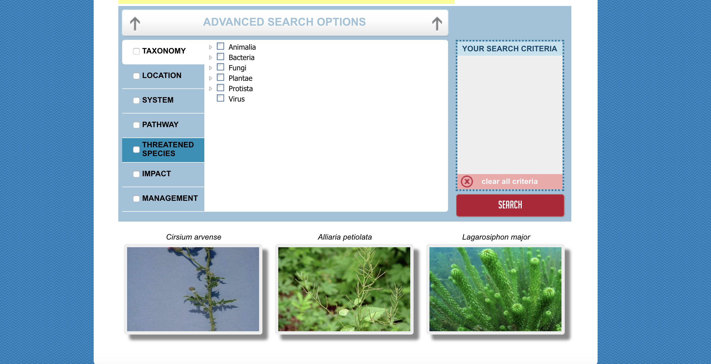

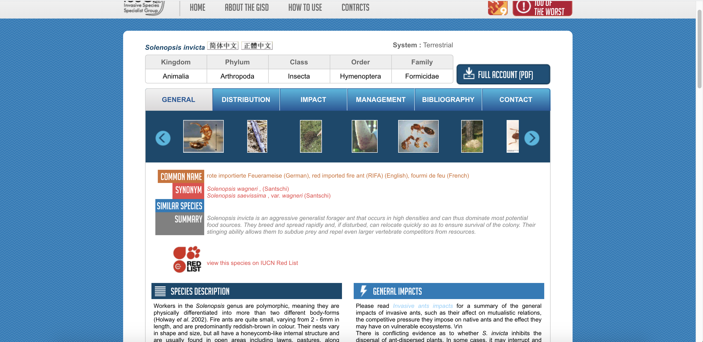

### 入侵物种概要

[👉网页URL](https://www.cabi.org/isc/datasheet/45082)

由国际农业和生物研究中心（Centre Agriculture Bioscience International, CABI）组织整理的入侵物种的百科全书数据库，类似于上述所提到的全球入侵物种数据库，也有详细的物种简介等信息，亮点是可以下载全球的分布信息的数据。

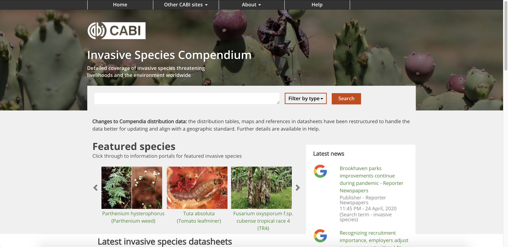

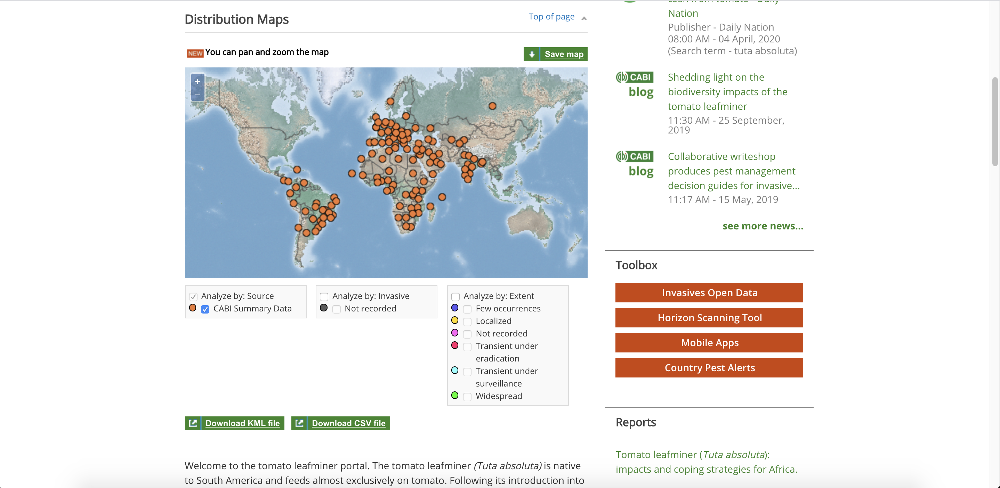

## 蚂蚁/Ants

### AntWiKi

[👉网页URL](https://www.antwiki.org/wiki/Welcome_to_AntWiki)

> Every Ant Tells a Story - And Scientists Explain Their Stories Here!

网站的副标题写得挺好的，这里面的蚂蚁资料相对较为全面，包括蚂蚁的生活史、行为、分布、社会结构、形态学、遗传和进化等方面的信息。如果知道蚂蚁的拉丁名的话，第一时间上这个网址查询就能找到比较详细的介绍了。

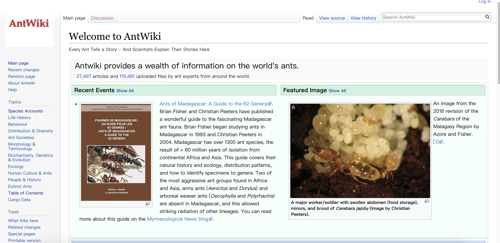

### AntWeb

[👉网页URL](https://www.antweb.org/)

大名鼎鼎的蚁网，号称是全球最大的蚂蚁在线数据库，由全世界的蚂蚁研究者上传标本图片，这个网址比较偏向于分类学，对于做鉴定的同学来说是个非常值得研究的网站。网站的宗旨就是为全世界的科研提供高质量的标本图片，因此只要你标注了图像的摄影师出处，全站的图片都是可以免费使用的，具体引用说明可以参考[AntWeb](https://www.antweb.org/citing_antweb.jsp)。

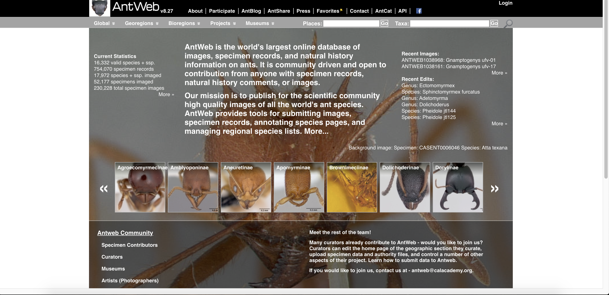

### AntCat

[👉网页URL](https://antcat.org/)

类似于AntWeb，也是一个偏向于分类学的蚂蚁网站，比较简洁，但个人感觉不如AntWeb好用。个人使用的不多。

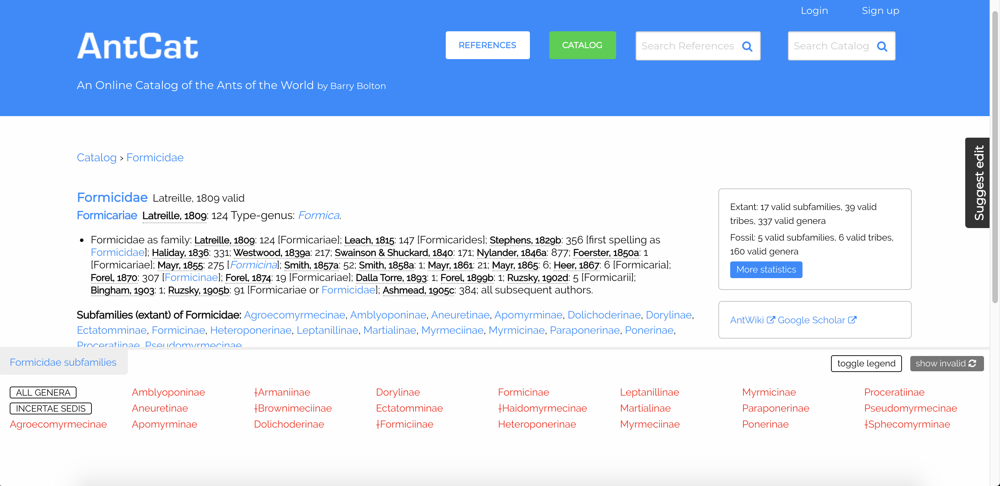

### AntMaps

[👉网页URL](https://antmaps.org/?)

AntMaps是一个全球蚂蚁分布的在线可视化数据库，通过色块的深浅可以清晰的看出全球各地蚂蚁种类的分布情况，鼠标悬停在一个地理区域还可以查看到州/省有多少个原生本地种类，属于比较酷的网站。

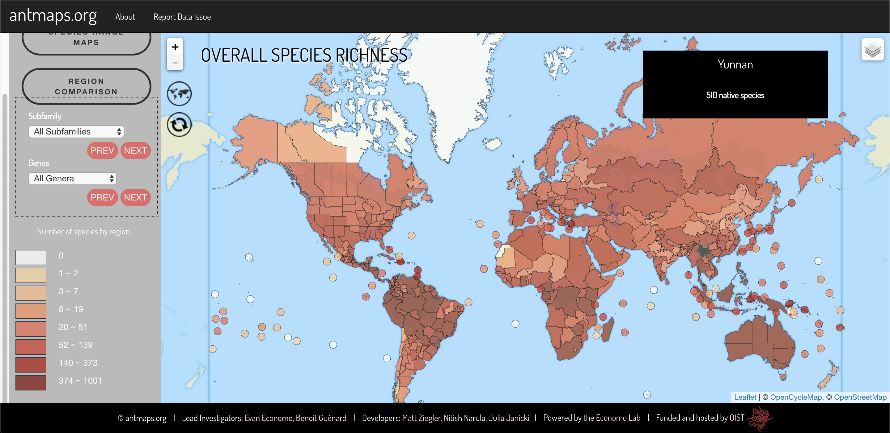

### 蚁网

[👉网页URL](http://www.ants-china.com/index.html)

这个是国内的蚁网，属于国内比较权威的蚂蚁网站了，按照亚科进行分类，能查到国内的大部分蚂蚁种类的信息，但是这个网址不允许转载和引用，本人法盲，看着网站下面的版权声明瑟瑟发抖，就不截图了，内容还是相当不错的，有对亚科、属的介绍，而且都是中文的，具体内容大家自信点进去看看就知道了。

### 蚂蚁分类图摘AntsPic

[👉网页URL](http://www.antspic.com/)

应该是一个用于学习用途的个人建站，有比较简单的介绍和分布信息，比较有趣的是作者提供了一些蚂蚁的相关冷门知识，可以供蚂蚁爱好者参考和了解蚂蚁的习性，右上角甚至还有一个资料分享的按钮，里面有些非常不错的扫描版书籍，这些买起来还是好贵的👀。

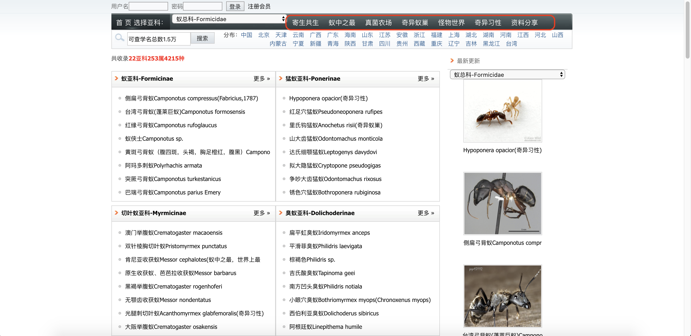

## 介壳虫/Scale

### ScaleNet

[👉网页URL](http://scalenet.info/catalogue/)

> ScaleNet是用于查找有关介壳虫信息的工具：分类阶元，命名历史，地理分布，生态联系和经济重要性都有简介。该项目是对介壳虫文献进行建模。目前，它包含来自24586个参考文献的数据，涉及8379个有效物种名称。

本人对介壳虫了解不多，之前爬过这个网站，感觉内容还是可以的。

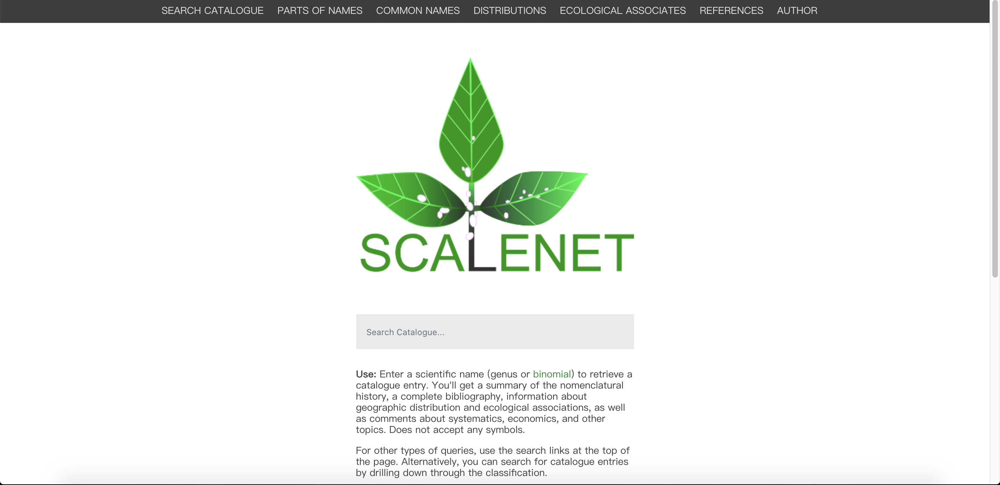

## 直翅目/Orthoptera

### Orthoptera Species File Online/直翅目物种文件在线

[👉网页URL](http://orthoptera.speciesfile.org/HomePage/Orthoptera/HomePage.aspx)

我觉得算是最大的直翅目在线数据库了，包括现存种类和化石种类的记录都有，主要是更新非常及时，最新的资料都可以查到。但有一个问题是国内的直翅目分类系统跟国际的不太一样，所以国内的命名可能还是要去翻昆虫志、经济昆虫志等书籍了，还有各大学术论文。

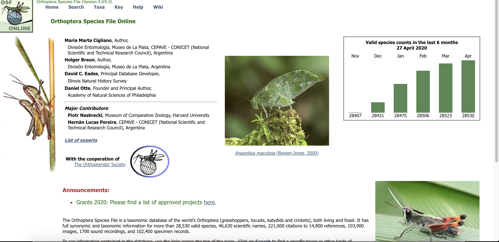

## 学术相关/Scholar

### 期刊简写查询

[👉网页URL](https://academic-accelerator.com/)

发文章的同学们可能会遇到在引用参考文献时必须对文章所在的期刊名进行缩写的，这个网站就是查询简写的，输入相应的期刊全称，点击DISCOVER就可以查到了，然后点**Abbreviation**就可以查看到简写了，甚至还会有一些该期刊的信息，比如top10%、IF之类的，个人使用起来感觉还不错。

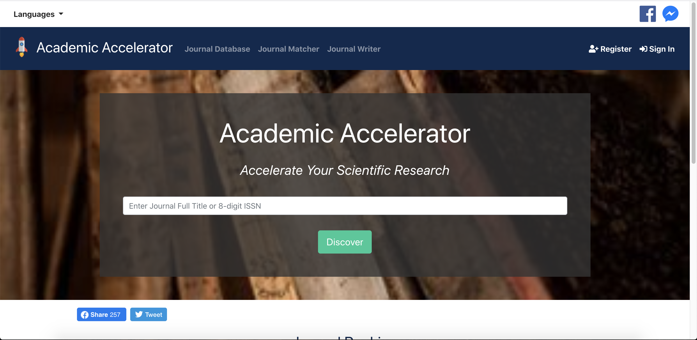

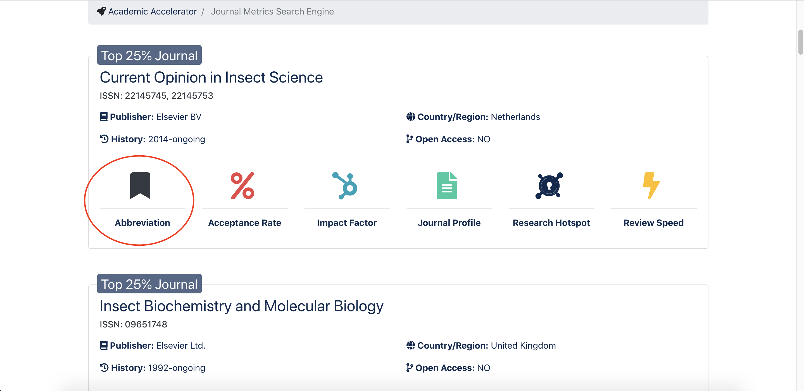

### 术语在线

[👉网页URL](http://www.termonline.cn/index.htm)

一些专有名词可以用这个网址查询，会给出相应的英文名或者中文名，还有所在的学科，来源也写得很明确，个人觉得是个很不错的网站。还有移动端的app，最近好像还上了微信的小程序。

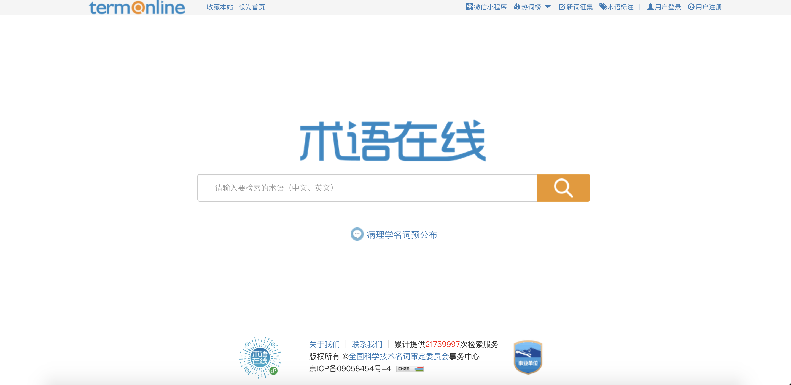

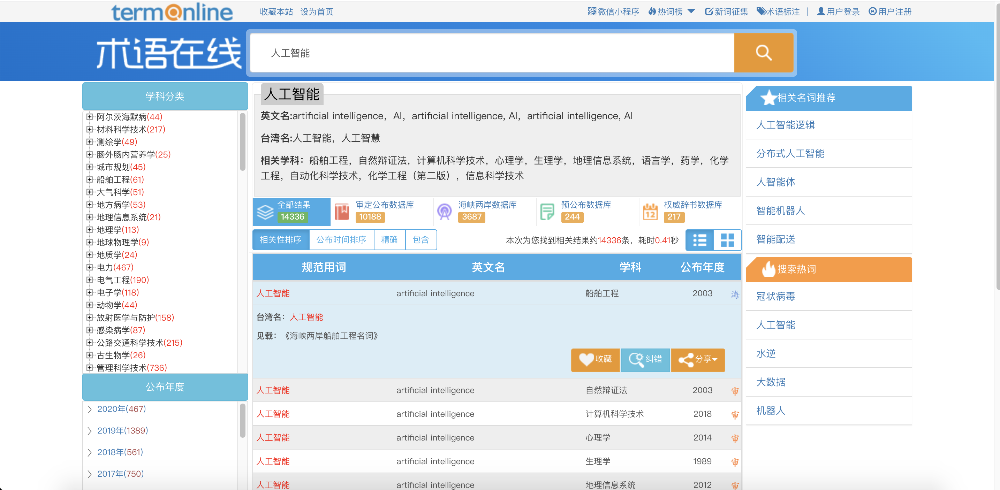